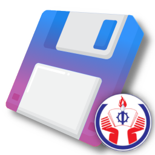

# 📋 Giới Thiệu Phần Mềm

    

 

**Quản Lý Sao Chép** là một phần mềm tiện ích do sinh viên thiết kế nhằm mục đích lưu trữ, phân loại và quản lý lịch sử sao chép (văn bản và hình ảnh) một cách khoa học và tối ưu nhất. Dự án là bài tập kết thúc học phần **Tư Duy Hệ Thống (SYTH220491)** tại Trường Đại học Công nghệ Kỹ thuật TP.HCM (HCMUTE).

---

## ⚙️ Cài Đặt Phần Mềm

> Phiên bản 1.0 → [<u>Cài Đặt</u>](https://github.com/DomieGD/clipboard-HCMUTE/releases/tag/1.0)

---

## 🎯 Đối Tượng Hướng Tới

Phần mềm được thiết kế tối ưu, tập trung giải quyết bài toán quản lý dữ liệu cho:
- **Sinh viên/Học sinh:** Cần một không gian để lưu lại hàng loạt trích dẫn tài liệu, link tham khảo, hay các đoạn code ví dụ phục vụ cho việc học tập, làm báo cáo và đồ án mà không cần chuyển đổi qua lại giữa các tab.
- **Người đi làm (Nhân viên văn phòng, Lập trình viên, Designer):** Những người thường xuyên làm việc với hàng tá thông tin mỗi ngày, cần một "bộ não phụ" để không bao giờ thất lạc những đoạn văn bản hay hình ảnh vừa "copy".

---

## 🚀 Các Chức Năng Chính

- 📝 **Lưu trữ tự động:** Tự động lưu lại toàn bộ lịch sử sao chép từ hệ điều hành (hỗ trợ văn bản và hình ảnh).
- 📌 **Ghim mục quan trọng:** Giữ lại các dữ liệu thiết yếu, đảm bảo không bị trôi đi theo thời gian.
- 🗑️ **Dọn dẹp linh hoạt:** Thao tác xóa từng mục riêng biệt, hoặc dọn dẹp toàn bộ dữ liệu lịch sử chỉ với một cú nhấp chuột.
- 📂 **Quản lý đa kho:** Cho phép tạo nhiều kho lưu trữ riêng biệt (Ví dụ: Kho Học Tập, Kho Code, Kho Cá Nhân, ...).
- 🌓 **Giao diện:** Hỗ trợ tự động nhận diện chế độ Tối/Sáng (Dark/Light mode) đồng bộ với hệ thống.

---

## ✨ Điểm Nổi Bật Của Phần Mềm

So với các công cụ mặc định (như Windows Clipboard), phần mềm của nhóm mang những điểm nhấn khác biệt:
1. **Giao Diện Hiện Đại:** Cấu trúc danh sách dạng thẻ (Card) trực quan, kết hợp với các hiệu ứng tương tác hiện đại và các nút biểu tượng SVG thân thiện.
2. **Khử Trùng Lặp Dữ Liệu Thông Minh:** Thuật toán tự động nhận diện và loại bỏ các dữ liệu bị sao chép trùng lặp liên tiếp, giúp tiết kiệm tối đa dung lượng bộ nhớ.
3. **Trải Nghiệm Xem Ảnh Tối Ưu:** Hỗ trợ tính năng click để xem chi tiết hình ảnh sao chép dưới dạng khung hình phóng to vô cùng tiện lợi.
4. **Bảo Mật Cục Bộ 100%:** Phần mềm hoạt động hoàn toàn offline. Dữ liệu của bạn được mã hóa và lưu an toàn trong cơ sở dữ liệu ngay trên máy tính cá nhân.
5. **Chạy Ngầm Siêu Nhẹ:** Khả năng thu nhỏ và chạy ngầm dưới dạng khay hệ thống giúp theo dõi clipboard mà không hề chiếm dụng không gian màn hình làm việc.

---

## 👥 Thành Viên Nhóm (Công Nghệ Thông Tin)

- **Nguyễn Hải Đăng** | MSSV: 25110183 (Quản Lý Dự Án)
- **Nguyễn Quốc Anh Khoa** | MSSV: 25110240 (Thiết Kế Giao Diện)
- **Huỳnh Trí Đức** | MSSV: 25110187 (Thiết Kế Cơ Sở Dữ Liệu)
- **Đỗ Ngọc Hân** | MSSV: 25133022 (Kiểm Thử)

**Liên hệ:** *domie\.gd (Discord)*

---

## 💡 Lời Tâm Sự

> **"Ơ!? Vừa nãy code vẫn chạy mà!!!"** 💢

Chào các bạn, chúng mình là sinh viên năm nhất của HCMUTE. Dự án **Quản Lý Sao Chép** này là sản phẩm của những nỗ lực học hỏi không ngừng, của những đêm dài miệt mài gõ phím, và cả những lần vò đầu bứt tai vì màn hình báo những dòng lỗi đỏ chót. 

Vì là những người lần đầu làm dự án, mang trong mình sức trẻ nhưng kinh nghiệm thực chiến thì vẫn còn đang trong quá trình bồi đắp, phần mềm chắc chắn không thể tránh khỏi việc tồn tại một vài **"tính năng ẩn"** (mà dân ngành hay gọi là Bug 🐛). Đôi khi ứng dụng có thể "giận dỗi" nếu thao tác quá nhanh, hoặc chưa bắt được hết mọi trường hợp phức tạp.

Dù vậy, chúng mình đã dốc hết tâm huyết để trau chuốt từng dòng code, từng thiết kế giao diện với hy vọng mang lại trải nghiệm tốt nhất có thể. Nếu bạn vô tình bắt gặp một lỗi nào đó, xin hãy mỉm cười thông cảm và xem đó như một "trải nghiệm thú vị". 

Rất mong nhận được những góp ý chân thành từ các bạn và Quý thầy cô để nhóm chúng mình ngày càng hoàn thiện hơn, từng bước trưởng thành trên con đường trở thành những kỹ sư phần mềm thực thụ! ❤️

***Cảm ơn bạn đã tin tưởng và trải nghiệm sản phẩm của nhóm chúng mình!***
